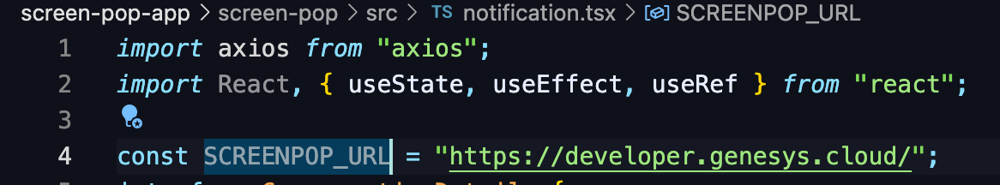

This Genesys Cloud Developer Blueprint explains how to create an embeddable app in scripts to set up a notification channel and listen for events. In this blueprint, a subscription is made to a user's active conversations. Events from this topic are then used to track the state of the conversation and alerts to the user when a conversation has ended and the chat should be closed

### Scenario

You notice that your agents are not always on call but calls are getting stacked on queues, you find out its because agents are not closing their chats when a conversation ends. So you need a mechanism to automatically prompt your agents to wrap up the chat. ([Inspired by URL Open at conversation end](https://developer.genesys.cloud/forum/t/url-open-at-conversation-end/15204))

### Solution

- Create a script that will open an IFrame and run an embedded client side app
- Set up Implicit Grant Login
- Connect to the Genesys Notification Service and subscribe to the agent's active conversations
- Screen pop a URL after a timeout has been reached starting from when a conversation ends

### Solution components

- **Genesys Cloud CX** - A suite of Genesys Cloud services for enterprise-grade communications, collaboration, and contact center management. In this solution, you use an Architect inbound message flow, a Genesys Cloud integration, a Genesys Cloud queue, web messaging configuration, and web messaging deployment.
- **Web messaging and Messenger** - The Genesys Cloud messaging platform that enables asynchronous conversations and a unified agent and supervisor experience across all Genesys Cloud messaging channels. Messenger is the predefined message window that customers use to communicate with bots and agents.
- **Scripts** - A Genesys tool that provides information to agents when handling conversations

## Prerequisites

### Specialized Knowledge

- Administrator-level knowledge of Genesys Cloud
- Experience using the Genesys Cloud Platform API

### Genesys Cloud Account

- A Genesys Cloud license. For more information, see [Genesys Cloud Pricing](https://www.genesys.com/pricing "Opens the Genesys Cloud pricing page") in the Genesys website.

## Implementation steps

### Download the repository containing the project files

1.  Clone the [using script to alert on inactivity blueprint repository](https://github.com/GenesysCloudBlueprints/using-script-to-alert-on-inactivity-blueprint "Opens the using-script-to-alert-on-inactivity-blueprint blueprint repository in GitHub").

### Set up Implicit Grant Login

1. Follow the [instructions](https://help.mypurecloud.com/articles/create-an-oauth-client/ "link to setup OAuth") on how to set up Implicit Grant Login
2. When selecting Grant Types, choose `Token Implicit Grant (Browser)`
3. After a Client ID has been generated, replace the ClientID variable in `grantLogin.tsx`
    

###  Set up Script 

1. When [setting up the script](https://help.mypurecloud.com/articles/about-scripting/ "link to set up scripts") add a webpage 
2. Insert the URL of the screen pop app in the webpage source 
3. Insert the variable `Scripter.InteractionID` 

### Set a URL to screen pop 

1. Replace the variable `SCREENPOP_URL` with your desired pop up URL 
    